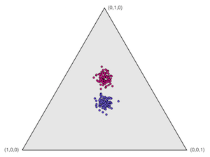
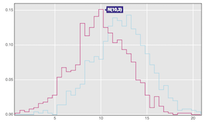

This is a set of [D3](http://d3js.org)-based graphic panels,
developed for the [R/qtlcharts](http://kbroman.org/qtlcharts) package
but useful more generally.

They are developed in [CoffeeScript](http://coffeescript.org); the
source is on [GitHub](https://github.com/kbroman/d3panels).

[Documentation on GitHub.](https://github.com/kbroman/d3panels/tree/master/doc)

---

Click on a panel for a corresponding interactive illustration.

<table class="wide">
<tr>
  <td class="left">
    <a href="assets/test/dotchart">
        
    </a>
  </td>
  <td class="right">
    <a href="assets/test/cichart">
        
    </a>
  </td>
</tr>
<tr>
  <td class="left">
    <a href="assets/test/scatterplot">
        
    </a>
  </td>
  <td class="right">
    <a href="assets/test/heatmap">
        
    </a>
  </td>
</tr>
<tr>
  <td class="left">
    <a href="assets/test/lodchart">
        
    </a>
  </td>
  <td class="right">
    <a href="assets/test/lodheatmap">
        
    </a>
  </td>
</tr>
<tr>
  <td class="left">
    <a href="assets/test/curvechart">
        
    </a>
  </td>
  <td class="right">
    <a href="assets/test/mapchart">
        
    </a>
  </td>
</tr>
<tr>
  <td class="left">
    <a href="assets/test/lod2dheatmap">
        
    </a>
  </td>
  <td class="right">
    <a href="assets/test/crosstab">
        
    </a>
  </td>
</tr>
<tr>
  <td class="left">
    <a href="assets/test/trichart">
        
    </a>
  </td>
  <td class="right">
    <a href="assets/test/histchart">
        
    </a>
  </td>
</tr>
</table>
---

## Usage

All of the functions are called as `d3panels.blah()`. And for each
chart, you first call the chart function with a set of options, like
this:

```coffeescript
mychart = d3panels.lodchart({height:600, width:800})
```

And then you call the function that's created with some selection and
the data:

```coffeescript
mychart(d3.select("div#chart"), mydata)
```

There are three exceptions to this:
[`add_lodcurve`](add_lodcurve.md), [`add_curves`](add_curves.md), and [`add_points`](add_points.md).
For these functions, you first need to call another function that
creates a panel
(for example, [`lodchart`](lodchart.md) or [`chrpanelframe`](chrpanelframe.md) in
the case of [`add_lodcurve`](add_lodcurve.md), or
[`panelframe`](panelframe.md) in the case of
[`add_curves`](add_curves.md) or [`add_points`](add_points.md)).  You
then use the chart function created by
that first call in place of a selection. For example:

```coffeescript
myframe = d3panels.panelframe({xlim:[0,100],ylim:[0,100]})
myframe(d3.select("body"))

addpts = d3panels.add_points()
addpts(myframe, {x:[5,10,25,50,75,90], y:[8,12,50,30,80,90], group:[1,1,1,2,2,3]})
```


## Links

To use the code, you need link to `d3panels.js` and `d3panels.css` (or
to `d3panels.min.js` and `d3panels.min.css`):

```html
<script type="text/javascript" src="https://rawgit.com/kbroman/d3panels/master/d3panels.js"></script>
<link rel=stylesheet type="text/css" href="https://rawgit.com/kbroman/d3panels/master/d3panels.css">
```

You also need to link to [D3.js](https://d3js.org) and
[d3-tip](https://github.com/Caged/d3-tip):

```html
<script charset="utf-8" type="text/javascript" src="https://d3js.org/d3.v3.min.js"></script>
<script type="text/javascript" src="https://rawgit.com/Caged/d3-tip/master/index.js"></script>
```

For a couple of panels (`curvechart` and `scatterplot`) you may also need
to link to [colorbrewer.js](https://github.com/mbostock/d3/blob/master/lib/colorbrewer/colorbrewer.js):

```html
<script type="text/javascript" src="https://rawgit.com/mbostock/d3/master/lib/colorbrewer/colorbrewer.js"></script>
```

---

Sources on [github](http://github.com):

- The [source for the package](https://github.com/kbroman/d3panels/tree/master)
- The [source for the website](https://github.com/kbroman/d3panels/tree/gh-pages)
